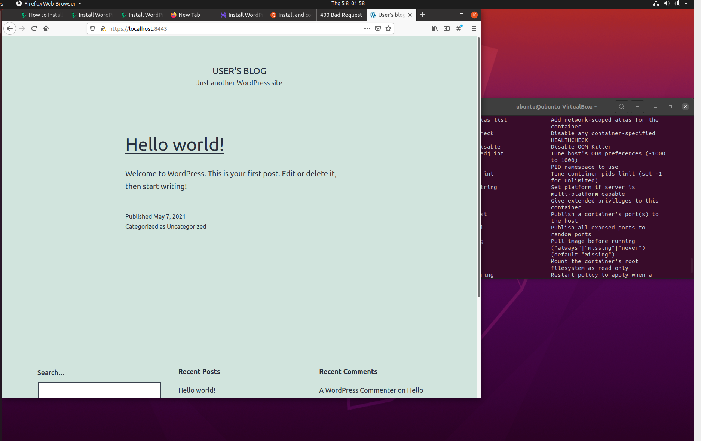

# Practice 1
---
## Requirements:
```
Setup VirtualBox
Create Ubuntu virtual machine
Setup Docker inside VM
Deploy WordPress with Command Line

```
---
## Guide
**1. Downloads VirtualBox and Ubuntu ISO file from this link below**

- VirtualBox: [https://www.virtualbox.org/](https://www.virtualbox.org/)
- Ubuntu ISO: [https://ubuntu.com/download/desktop](https://ubuntu.com/download/desktop)

After downloads these files, you follow that link [https://www.freecodecamp.org/news/how-to-install-ubuntu-with-oracle-virtualbox/](https://www.freecodecamp.org/news/how-to-install-ubuntu-with-oracle-virtualbox/) step by step to install Ubuntu on VirtualBox. If you have any error, just google.

**2. Setup Docker**
*Install using the repository*
- Update the apt package index and install packages to allow apt to use a repository over HTTPS
```
$ sudo apt-get update
$ sudo apt-get install \
    apt-transport-https \
    ca-certificates \
    curl \
    gnupg \
    lsb-release
```
- Add Docker’s official GPG key

```
$ curl -fsSL https://download.docker.com/linux/ubuntu/gpg | sudo gpg --dearmor -o /usr/share/keyrings/docker-archive-keyring.gpg

```
*Install Docker Engine (you should follow the link [https://www.linode.com/docs/guides/install-docker-ce-ubuntu-1804/](https://www.linode.com/docs/guides/install-docker-ce-ubuntu-1804/)*
- Remove any older installations of Docker that may be on your system:
```
$ sudo apt remove docker docker-engine docker.io
```
- Make sure you have the necessary packages to allow the use of Docker’s repository:
```
$ sudo apt install apt-transport-https ca-certificates curl software-properties-common gnupg
```
- Add Docker’s GPG key:
```
$ curl -fsSL https://download.docker.com/linux/ubuntu/gpg | sudo apt-key add -
```
- Verify the fingerprint of the GPG key:
```
$ sudo apt-key fingerprint 0EBFCD88
```
You should see output similar to the following:

```
pub   rsa4096 2017-02-22 [SCEA]
      9DC8 5822 9FC7 DD38 854A  E2D8 8D81 803C 0EBF CD88
uid           [ unknown] Docker Release (CE deb) <docker@docker.com>
sub   rsa4096 2017-02-22 [S]
```
- Add the *stable* Docker repository:
```
$ sudo add-apt-repository "deb [arch=amd64] https://download.docker.com/linux/ubuntu $(lsb_release -cs) stable"
```
- Update your package index and install Docker CE:
```
$ sudo apt update
$ sudo apt install docker-ce
```
- Add your limited Linux user account to the docker group:
```
$ sudo usermod -aG docker $USER
```
- Check that the installation was successful by running the built-in “Hello World” program:
```
$ docker run hello-world
```
**3. Deploy WordPress using Command Line**
- Create a network to connect database with app
```
$ sudo docker network create wordpress-network
```
- Create MariaDB volume
```
$ sudo docker volume create --name mariadb_data
```
Run to connect MariaDB with network
```
$ sudo docker run -d --name mariadb \
   --env ALLOW_EMPTY_PASSWORD=yes \
   --env MARIADB_USER=bn_wordpress \
   --env MARIADB_PASSWORD=bitnami \
   --env MARIADB_DATABASE=bitnami_wordpress \
   --network wordpress-network \
   --volume mariadb_data:/bitnami/mariadb \
   bitnami/mariadb:latest
```
- Create WordPress Volume and Run

Create Volume
```
$ sudo docker volume create --name wordpress_data
```
Run to connect with network
```
$ sudo docker run -d --name wordpress \
   -p 8080:8080 -p 8443:8443 \
   --env ALLOW_EMPTY_PASSWORD=yes \
   --env WORDPRESS_DATABASE_USER=bn_wordpress \
   --env WORDPRESS_DATABASE_PASSWORD=bitnami \
   --env WORDPRESS_DATABASE_NAME=bitnami_wordpress \
   --network wordpress-network \
   --volume wordpress_data:/bitnami/wordpress \
   bitnami/wordpress:latest
```

**Then, open web browser and access that link to see result [https://localhost:8443](https://localhost:8443)**

